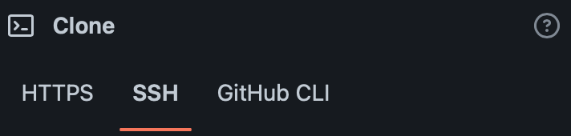
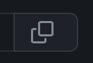

# Workshop more or less complete

## Setup

1. Create the repository from this template by click at "Use this template".
2. Named the repository "so-workshop-more-or-less-complete".
3. Click at "Create repository from template".
4. Wait for a moment, after successful created the repository clone it to your local machine by:

    4.1 Click at Code button.  


    4.2 Click at SSH.  


    4.3 Click at Copy button.  


    4.4 Run the command you just copied in terminal to clone the reposiroty.

## Run

Type this command in terminal to run game 1

```js
node game1.js
```

For game 2

```js
node game2.js
```

To exit the game press Ctrl+C.
